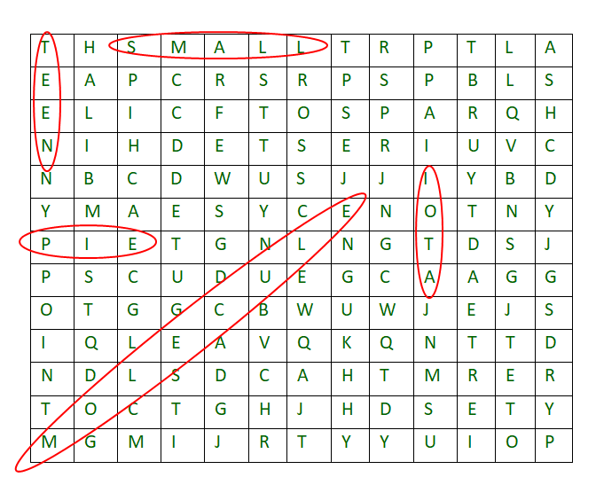

# Puzzle
Repository for test exercise only

[](https://travis-ci.com/DKorytkin/puzzle)

Application generate random crossword puzzle and try to find exist words from file



**Content:**
 - [Install](#install)
 - [Usage](#usage)
   - [App flags](#exists-flags-for-app)
   - [Run with default params](#run-with-default-params)
   - [Run with custom params](#run-with-custom-params)
 - [Licence](#licence)

## Install
```bash
pip install git+https://github.com/DKorytkin/puzzle.git@data_robot_homework
```

## Usage
#### exists flags for app
  - `-l` or `--length` - you can change default(15) puzzle length
  - `-d` or `--depth` - you can change default(15) puzzle height
  - `-f` or `--file` - you can change default file(words.txt) to another
  - `-q` or `--quiet` - you can disable verbose mode
  - `-h` or `--help` - you can see all CLI commands

**examples:**
```bush
puzzle -h
```
```bash
usage: Puzzle [-h] [-f FILE] [-l LENGTH] [-d DEPTH] [-q]

Programme generate crossword puzzle and try to find exist words from file

optional arguments:
  -h, --help                       show this help message and exit
  -f FILE, --file FILE             you can to change file with words
  -l LENGTH, --length LENGTH       you can to choice board length
  -d DEPTH, --depth DEPTH          you can to choice board depth
  -q, --quiet                      you can to disable verbose mode

```

#### run with default params 

- `--length=15`
- `--depth=15`
- `--file=words.txt`
- `--quiet=False`

```bash
puzzle
```
#### run with custom params
```bash
puzzle -l 10 -d 5 --file my_words.txt
```
**simple response:**
```bash
Was generated puzzle size of 10x5:
l | x | r | z | l | v | p | q | f | s
u | v | q | z | a | b | x | y | n | k
o | e | v | w | f | p | o | s | s | g
n | t | v | y | t | a | m | o | n | r
m | l | o | t | v | f | u | x | z | n
Found 27 words:
['aft', 'am', 'at', 'boo', 'fa', 'gs', 'ks', 'la', 'lo', 'lot', 'ma', 'mat', 'mu', 'no', 'on', 'ox', 'pa', 'rs', 'so', 'sop', 'sox', 'tam', 'to', 'um', 'vet', 'zap', 'zoo']
```
## Licence
This project is licensed under the **MIT License** - see the [LICENSE.md](./LICENSE.md) file for details
